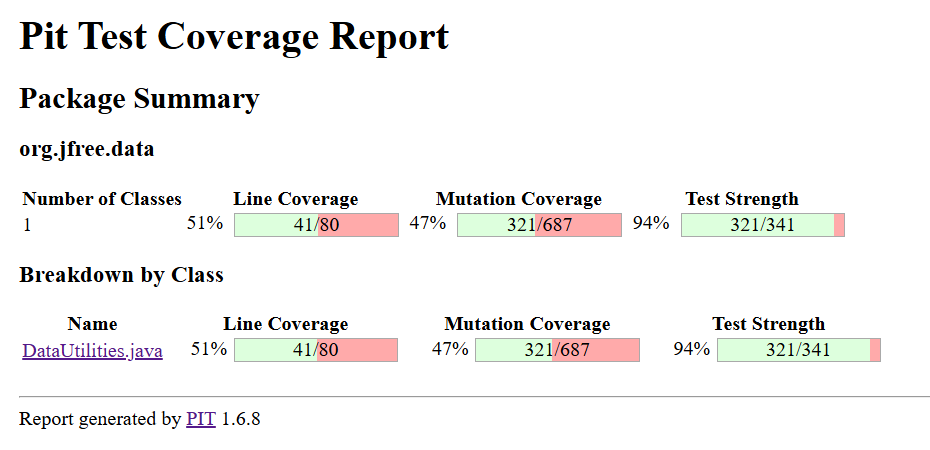
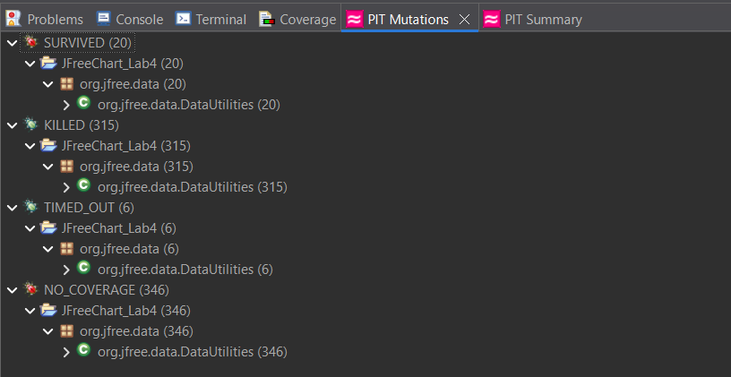
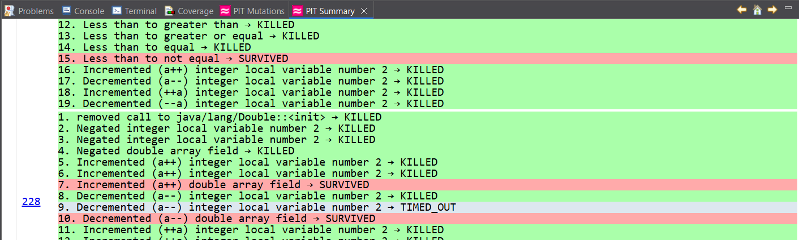

**SENG 637 - Dependability and Reliability of Software Systems**

**Lab. Report \#4 – Mutation Testing and Web app testing**

| Group \#:      |  5  |
| -------------- | --- |
| Student Names: | Lawrence |
|                | Kwesi |
|                | Joe |
|                | Zhanzhi |

# Introduction

# Analysis of 10 Mutants of the Range class 

# Report all the statistics and the mutation score for each test class

## DataUtilitiesTest

After changing the nullNotPermitted() function in ParamChecks.java to throw InvalidParameterException as mentioned in the Javadoc, and commenting out some failing test cases, the statistics are:

| Method                                 | Survived | Killed or Timed Out | Total | Coverage % |
| -------------------------------------- | -------- | ------ | ----- | ---------- |
| DataUtilities.calculateRowTotal        | 5        | 62     | 67    | 92.54      |
| DataUtilities.calculateColumnTotal     | 5        | 62     | 67    | 92.54      |
| DataUtilities.createNumberArray        | 3        | 35     | 38    | 92.11      |
| DataUtilities.createNumberArray2D      | 1        | 43     | 44    | 97.73      |
| DataUtilities.getCumulativePercentages | 6        | 119    | 125   | 95.20      |
| Total                                  | 20       | 321    | 341   | 94.13      |

Summary:  

Detailed:  

# Analysis drawn on the effectiveness of each of the test classes

## DataUtilitiesTest

After modifying the source code and test code as mentioned above, no new test cases were written for DataUtilities. It is because every 'survived' mutant is one of the following three equivalent:
1. Less than to not equal: It generates the same for-loops as before, where 0 <= i < count
2. Incremented (a++) double array field: The post-increment is performed after the value is assigned
3. Decremented (a--) double array field: The post-decrement is performed after the value is assigned
  

Therefore, considering DataUtilitiesTest covers all other mutants, it is effective enough for mutation testing. 

# A discussion on the effect of equivalent mutants on mutation score accuracy

Take DataUtilitiesTest as an example, only 5.87% of the mutants are equivalent. Therefore, it reduces the mutation score to a small degree. In other words, equivalent mutants slightly affect the mutation score accuracy.

# A discussion of what could have been done to improve the mutation score of the test suites

# Why do we need mutation testing? Advantages and disadvantages of mutation testing

# Explain your SELENUIM test case design process

# Explain the use of assertions and checkpoints

# how did you test each functionaity with different test data

# How the team work/effort was divided and managed

# Difficulties encountered, challenges overcome, and lessons learned

# Comments/feedback on the assignment itself
